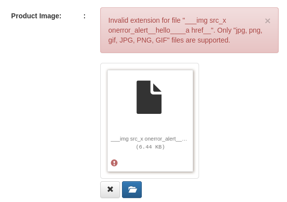

# Report of XSS Vulnerabilities

### Alberto Giust ID 211460
### Security Testing
### Project: inventory-management-system


This report goal is to find XSS vulnerabilities in the project `inventory-management-system`. Pixy was used to identify the possible sinks and all the outputs were analyzed and divided between true and false positives. For the true positives an attack vector is proposed (applied in the tests with selenium) and a possible fix that is applied to the echo function. Attack vectors and fixes can be similar through multiple true positives because files are very similar (they perform similar operations so lots of code is repeated), so the explaination can be a little redundant. This report is written to offer an immediate view on what are the problems for every file and what are the solutions adopted to fix the vulenrabilities. The majority of attack vectors try to make an alert appear on to the screen, because users can tricked by convincing them to click to continue and maybe retrieve more information.
All the test were created with an already populated database, and then every test was changed to clean and repopulate every time the database. The products created directly from Java have the default image.
The result analysis produced:
- 41 True Positives
- 28 false Positives
- 5 considered as false positives because no tests are provided, but the function used can be vulnerable (`json_encode` is not safe, but no attack vector are provided. As a developer I would however suggest to sanitze the output before printing in JSON format).
In case of problem in opening files these are the github links to the report, the fixed source code and the tests:
- report: https://github.com/ainter21/report-sectest.git
- fixed source code: https://github.com/ainter21/inventory-management-system.git
- test cases: https://github.com/ainter21/sectest-project.git

## True Positives

- **xss_dashboard.php_10_min** (line 153): outputs the username in the orders table. If the username is a HTML formatted string, it will be printed as it is without controls, so it can be used insert malicious code. The **User Wise Order** is only seen by the admin.
  - **Attack vector**: change the username from user setting with HTML code, logout and login again. The username will be printed as a `h1`
  - **Fix**: output the username after it has been sanitized with `htmlentities($orderResult['username'])`
- **xss_fetchBrand.php_1_min** (line 38): outputs the brand name, the availability and a button to edit or remove it. It is a xss vulnerability because the brand name with HTML malicious code.
  - **Attack vector**: create a brand with this name `Malicious<script>alert("brand")</script>`. After the creation of the brand, fetch brand will be called and the alert will be printed.
  - **Fix**: sanitize the name of the brand with `htmlentities()`.
- **xss_fetchCategories.php_1_min** (line 38): fetches all the categories created. The user with the right priviligies can inject malicious code in the category name and this will be printed as HTML formatted text. It is a vulnerability.
  - **Attack vector**: create a new category with this name: `Malicious<script>alert("categories")<script>`. After the creation of the category, fetchCategories will be called and an alert will be shown.
  - **Fix**: sanitize the output of tht query (`row[1]` contains the name of the category, so you have to call `htmlentities()` on it). 
- **xss_product.php_1_min** (line 109): this is a true sink because the query fetches all the brand to populate the select item for the creation of a new product. As a result, the attacker can create a brand with javascript code that won't be printed in the select option, but it will be executed when the page will be created. Only `$row[1]` is affected because `$row[0]` contains the id of the brand, a value not set by the end user.
  - **Attack vector**: create a brand with malicious javascript code in the name (`Malicious<script>alert("brand")</script>"`) and load the product page. An alert message will be printed on the screen.
  - **Fix**: sanitize the name of the brand with `htmlentities()`. However, in the product page the the list of brands are fetched two times so two alert dialogs will be shown. To completely fix this vulnerability it is necessary to fix both of the outputs, this one and the one at line 267, which is found by pixy in the `xss_product.php_3_min` file. After fixing this vulnerability, no more alert dialogs will be shown, and the test will fail.
- **xss_product.php_2_min** (line 128): if a category with malicious javascript code is created, when the user opens the product page, all categories are fetched to populate the select used to create a new product. The code is executed. Only `$row[1]` is affected because contains text inserted by the user, while `$row[1]` contains only the id of the category.
  - **Attack vector**: create a category with javascript code in its name (`Malicious<script>alert("categories")</script>`). Then go to the product page. An alert dialog will pop up.
  - **Fix**: at line 128, calls `htmlentities` on `row[1]`. The output will be sanitized. As for brand, also categories will prompt two alert because the categories list is fetched also at line 287, so you have to sanitize this line to avoid any alert message in the product page.
- **xss_product.php_3_min** (line 267): as for product 1, this echo function is called after fetching all brands. If the user inserts malicious javascript code into a brand name, this code will be executed when the client go to the product page. The test has the same code of **xss_product.php_1_min**.
  - **Attack vector**: create a new brand with name `Malicious<script>alert("brand")</script>"`, then move to Product page. An alert box will pop up.
  - **Fix**: sanitize `row[1]` variable at line 267, surrounding it with `htmlentities`. `row[0]` is not a sink because it is the brand id. To completely fix the brand output, it is mandatory to fix also **xss_product.php_1_min**.
- **xss_product.php_4_min** (line 287): as for product 2, also in this case if a category is created with malicious code in its name, this code will be executed when the client goes to the product page.
  - **Attack vector**: create a category with javascript code in its name (`Malicious<script>alert("categories")</script>`). Then go to the product page. An alert dialog will pop up.
  - **Fix**: at line 286, calls `htmlentities()` on `row[1]`. The output will be sanitized. As for brand, also categories will prompt two alert because the categories list is fetched also at line 128, so you have to sanitize this line to avoid any alert message in the product page.
- **xss_fetchProduct.php_1_min** (line 63, 65 & 67): this echo function outputs data of each not removed product. If a product is created with malicious code in the name, rate and quantity, the code will be executed each time this php code is called. 
  - **Attack vector**: create a new product with malicious code in name, rate, quantity, and select a brand and category. A pop up dialog will be shown for each of the javascript code inserted:
    - name: `Malicious<script>alert("name")</script>`
    - rate: `10<script>alert("rate")</script>`
    - quantity: `10<script>alert("quantitiy")</script>`
    - brand and category: `Apple` and `PC`
    - image: not vulnerable
  - **Fix**: sanitize the output of the name, quantity and rate with `htmlentities()`.
- **xss_fetchProductData.php_1_min**: it is called when the user adds one row for the product in the new order page.
  - **Attack vector**: create a product with malicious javascript code in its name. Then go to `orders -> add new order` and add a row of product. An alert will pop up.
  - **Fix**: sanitize the echo function calling this snippet of code before echoing the output. This code will sanitize the name.
```php
...
if(mysqli_num_rows($result) > 0) { 

    while($row =  mysqli_fetch_array($result)) {
        $row[1] = htmlentities($row[1]);
    }
}
...
```
- **xss_fetchOrder.php_1_min** (line 56 & 58): this method is called to retrieve all the orders. There are some fields that are vulnerable to xss attack. 
  - **Attack vector**: create an order with malicious code in the `name` of the `client` and in the client. This code will be executed when the user goes to the order page. The date input field is not vulnerable because there is an automatic sanitisation.
  - **Fix**: sanitize `$row[2]` and `$row[3]` of the array that is generated to return using `htmlentities()`.
- **xss_getOrderReport.php_1_min**: if an order contains malicious code, this code will be executed in the new window generated for the report list table. The test provided executes and it passes, but it is longer than the other tests and the console outputs these lines:
```
###!!! [Parent][MessageChannel] Error: (msgtype=0x59001A,name=PHttpChannel::Msg_DeleteSelf) Channel error: cannot send/recv

console.error: (new Error("SessionFile is closed", "resource:///modules/sessionstore/SessionFile.jsm", 433))
ExceptionHandler::GenerateDump cloned child 8709
ExceptionHandler::SendContinueSignalToChild sent continue signal to child
ExceptionHandler::WaitForContinueSignal waiting for continue signal...
[GFX1-]: Receive IPC close with reason=AbnormalShutdown
Exiting due to channel error.
```
  - **Attack vector**: create an order with javascript code inside name and contact number, then go to report page and create the report. In the new window the code will be executed. in this case new HTML components are added to the page.
  - **Fix**: sanitize the table entries used to populate the report with `htmlentities()`.
- **xss_orders.php_6_min** (line 37): this echo function prints the id of the order to be edited. This id is directly taken from the query parameter. The attacker can insert some code into this parameter to perform an xss attack.
  - **Attack vector**: use selenium to navigate to this link: `http://localhost/inventory-management-system/orders.php?o=editOrd&i=8<script>alert(\"id\")</script>`. An alert will pop up.
  - **Fix**:sanitize the input with `htmlentities()`
- **xss_orders.php_11_min** (line 111): this echo function is used to populate the select of the products in the orders page. By default, three select rows are generated, so this code is executed three times. If the admin created a product with malicious code in its name, this code will be executed. Only the name is vulnerable, because the id is not inserted by the user.
  - **Attack vector**: create a product with javascript code in its name, then go to add orders page. Three dialog box will be shown.
  - **Fix**: sanitize `$row['product_name']` with `htmlentities()`.
- **xss_orders.php_21_min** (line 293): this echo function is used to populate the edit order page, more precisely it will output the name of the client. It can be exploited to insert malicious javascript code because it is not sanitized.
  - **Attack vector**: create a new order with this string as the name of the client: `"/><script>alert("name")</script><input type="hidden"`. This will pop up an alert box.
  - **Fix**: sanitize `$data[2]` with `htmlentities()`.
- **xss_orders.php_22_min**(line 299): this echo function prints the contact name into an input field, used to edit the current order. It is vulnerable to xss attacks because it is not sanitized.
  - **Attack vector**: create a new order with this client contact: `"/><script>alert("contact")</script><input type="hidden"`, then go to edit order page. An alert will be shown up.
  - **Fix**: sanitize `$data[3]` with `htmlentities()`.
- **xss_orders.php_27_min** (line 345): this echo function is used to populate the select created in the edit order page. If there is a product with malicious code int its name, this code will be executed.
  - **Attack vector**: create a product with this name: `Malicious<script>alert("name")</script>`. Go to orders page and edit one order. An alert with `name` string in it will be shown.
  - **Fix**:sanitize `$row['product_name']` with `htmlentities()`.
- **xss_orders.php_29_min** (line 353): this echo function is used to populate the selector of products in the edit order page. It is vulnerable because the user can edit the order adding a product with malicious code into the rate value. If the user tries to re-edit the order, the code will be executed.
  - **Attack vector**: create a product with javascript code in its rate (`"/><script>alert("hello")</script><input type="hidden"`). Create a new order (don't use this product). Edit the order and add the malicious product. Edit again the order: an alert message will pop up.
  - **Fix**: sanitize `$orderItemData['rate']` with `htmlentities()`.
- **xss_orders.php_31_min** (line 354): as for the previous one, this echo function is used to populate the selector of products, but this input is `hidden`.
  - **Attack vector**: create a product with javascript code in its rate (`"/><script>alert("hello")</script><input type="hidden"`). Create a new order (don't use this product). Edit the order and add the malicious product. Edit again the order: an alert message will pop up.
  - **Fix**: sanitize `$orderItemData['rate']` with `htmlentities()`.
- **xss_orders.php_32_min** (line 365): there are 2 echo functions in this line: the first prints out the id of the product, that it is not vulnerable because the id is not created by the user (it is an integer autoincremented in the database). The second echo function prints the available quantity of the product already inserted into the order. The attacke can create an order, than edit the quantity of the product, injecting malicious code into it and finally go to the edit order page. The code will be executed.
  - **Attack vector**: create a new order, edit the product quantity inserted into the order with this javascript code: `11<script>alert("quantity");</script>`. Finally go to the edit order page. An alert will pop up.
  - **Fix**: sanitize the output with `htmlentities()`.
- **xss_orders.php_35_min** (line 380): in this case, if the user changes the type of the input quantity and insert javascript code and he refreshes the page, the code will be executed.
  - **Attack vector**: create an order, then go to edit order. Use javascript to change the type of the quantity input to `text` and change the value with this string `"\"/><script>alert(\"quantity\")</script><input type=\"hidden\"`. Refresh the page: a dialog box will pop up.
  - **Fix**: sanitize `$orderItemData['quantity']` with `htmlentities()`.
- **xss_orders.php_37_min** (line 384): this echo function prints the total amount of the product in the edit order page. This value can be changed in the addOrder, when the user add a product. There are two inputs: one disabled, to show the result, and one hidden to pass the value to the server. The attacker can change the hidden value, and insert malicious code.
  - **Attack vector**: create a new order and using senenium executeScript function, set the value of the hidden parameter with this string `11"/><script>alert("hello")</script><input type="hidden"`. Then go to the edit order page. An alert will pop up.
  - **Fix**: sanitize the output: `htmlentities($orderItemData['total'])`.
- **xss_orders.php_39_min** (line 385): this has the same vulnerability as **xss_orders.php_37_min**.
  - **Attack vector**: same as **xss_orders.php_37_min**.
  - **Fix**: same as **xss_orders.php_37_min**. 
- **xss_orders.php_41_min** (line 404): this echo function populates a disabled input used to show the sub amount of the order, in the edit order page.
  - **Attack vector**: create a new order and with javascript change the value of the subAmount hidden input to `"/><script>alert("subAmountValue")</script><input type="hidden"`. Then go to edit order. A pop up will show up.
  - **Fix**: sanitize with `htmlentities()`.
- **xss_orders.php_42_min** (line 405): this has the same procedure of **xss_orders.php_41_min**, but the input is not disabled, but hidden.
  - **Attack vector**: same as **xss_orders.php_41_min**.
  - **Fix**: same as **xss_orders.php_41_min**.
- **xss_orders.php_43_min** (line 412): this is the same vulnerability of of the previous ones: in this case the value exploitable is the Total Amount. This prints the value into a disable input.
  - **Attack vector**: create an order and inject using javascript malicious code into the Total Amount hidden input `"/><script>alert("total amount")</script><input type="hidden"`. Then go to the edit order page, and the code will be executed.
  - **Fix**: sanitize the output with `htmlentities()`.
- **xss_orders.php_44_min** (line 413): this echo function prints the same content as **xss_orders.php_43_min**, but the input populated is hidden, instead of disabled.
  - **Attack vector**: same as **xss_orders.php_43_min**.
  - **Fix**: same as **xss_orders.php_43_min**.
- **xss_orders.php_45_min** (line 419): this echo function is used to print the discount value to the input in the edit order page. It is vulnerable to xss.
  - **Attack vector**: create a new order and insert into the discount value this string `"\"/><script>alert(\"discount\")</script><input type=\"hidden\""`. Then, go to the edit order page. An alert will pop up
  - **Fix**: sanitize the input of the echo function with `htmlentities()`.
- **xss_orders.php_46_min** (line 425): this echo function prints the Grand Total in the edit order page, more precisely in the disabled input field. It is vulnerable because this value can be changed during the creation of an order.
  - **Attack vector**: create a new order and change the Grand Total value using javascript, and substitute it with `\"/><script>alert(\"grandTotalValue\")</script><input type=\"hidden\"`. Then go to the edit order page. An alert will pop up.
  - **Fix**: sanitize the parameter with `htmlentities()`.
- **xss_orders.php_47_min** (line 426): this echo function prints the same content of **xss_orders.php_46_min**, but in an hidden input field. The vulnerability and the fix are the same.
  - **Attack vector**: same as **xss_orders.php_46_min**.
  - **Fix**: same as **xss_orders.php_46_min**.
- **xss_orders.php_50_min** (line 432): this echo function prints the VAT in the disable input in the edit order page. It will execute the code if, during the creation of the event the attacker put some code in the input field, bypassing html restriction.
  - **Attack vector**: create a new order and insert in the VAT hidden input this string: `"/><script>alert("VAT")</script><input type="hidden"`. Then, go to the edit order page, and an alert will pop up.
  - **Fix**: sanitize the input with `htmlentities()`.
- **xss_orders.php_51_min** (line 433): this echo function prints the same value of the function above, but in a hidden input field.
  - **Attack vector**: same as **xss_orders.php_50_min**.
  - **Fix**: same as **xss_orders.php_50_min**.
- **xss_orders.pgp_52_min** line(439): this echo functio prints the *gstn* in the edit order page. There is no way to insert this value during the creation of an order, so it is mandatory to create an order, edit it inserting in this input field some code, and refresh the page.
  - **Attack vector**: edit an existing order. Isert in the *gstn* field this string `"/><script>alert("hello")</script><input type="hidden"`. Refresh the page. An alert will pop up.
  - **Fix**: sanitize the input with `htmlentities()`.
- **xss_orders.php_53_min** (line 448): the echo function prints the value of the paid amount. It can be exploited inserting during the add order, some malicious javascript code. It will be saved in the database. When the user navigates to the edit order page, this code will be executed.
  - **Attack vector**: create a new order and insert in the input field *Paid Amount* this string `"/><script>alert("paid amount")</script><input type="hidden"`. This code will be executed when opening the edit order page.
  - **Fix**: sanitize the input with `htmlentities()`.
- **xss_orders.php_54_min** (line 454): this echo function populates the disabled input of *Due Amount*.
  - **Attack vector**: create a new order and use javascript in selenium to populate the hidden input *dueValue* with this string: `"/><script>alert("due value")</script><input type="hidden"`. Then go to edit order page. An alert will pop up.
  - **Fix**: sanitize the input with `htmlentities()`.
- **xss_orders.php_55_min** (line 455): the echo function prints the same value of **xss_orders.php_54_min**, but in a hidden input field.
  - **Attack vector**: same procedure of  **xss_orders.php_54_min**.
  - **Fix**: sanitize the input with `htmlentities()`.
- **xss_orders.php_64_min** (line 513): this echo funtions prints the id of the order into the value of the submit button for editing the order. As for **xss_orders.php_6_min**, the id can be passed via query parameter, but the code has to be slightly different.
  - **Attack vector**: login and go to edit page of an order using `driver.get()`, passing this URL: `http://localhost/inventory-management-system/orders.php?o=editOrd&i=8"/><script>alert("hello")</script><input type="hidden"`. An alert will pop up.
  - **Fix**: sanitize the input with `htmlentities()`. 
- **xss_printOrder.php_1_min** (line 193): this echo function prints a table created with details of the order. Some variables are printed, and they are exploitable by an attacker who wants to inject malicious code in the print page. 
  - **Attack vector**: create an order and then edit it with the following values.
    - **clientName**: `<h1 id=\"malicious_name\">name</h1>`.
    - **clientContact**: `<h1 id=\"malicious_contact\">1234</h1>`.
    - **total value of the item ordered**: `\"/><h1 id=\"malicious_product\">1234</h1>`.
    - **subTotal**: `\"/><h1 id=\"malicious_subtotal\">988</h1>`.
    - **gstn**: `\"/><h1 id=\"malicious_gstn\">333</h1>`.
    
    Alert aren't used in these test because selenium has difficulties in handling alerts in differents windows. However, these `h1` items will be shown in the print page.
  - **Fix**: sanitize the input of these variables with `htmlentities()`.
- **xss_setting.php_1_min** (line 35): this echo function is used to populate the edit username input field. It is vulnerable to xss attack.
  - **Attack vector**: go to setting page, change the username with this string: `admin"/><script>alert("hello")</script><input type="hidden"`. Save the changes and refresh the page. An alert will pop up.
  - **Fix**: sanitize the input with `htmlentities()`.
- **xss_setting.php_3_min** (line 57): as for **xss_setting.php_1_min**, also this echo function pouplate an input field in the setting page, more precisely the bio input filed. It is vulnerable to xss.
  - **Attack vector**: go to setting page, change the bio with this string: `bio"/><script>alert("hello")</script><input type="hidden"`. Save the changes and refresh the page. An alert will pop up.
  - **Fix**: sanitize the input with `htmlentities()`.
- **xss_index.php_2_min** (line 100): `$_SERVER['PHP_SELF']` contains the path of the page shown in the browser. If the attacker inserts malicious code into the URL, the code will be executed when the page is loaded, because this variable is used to populate the action attribute of the login form.
  - **Attack vector**: navigate to this URL `http://localhost/inventory-management-system/index.php/%22%3E%3Cscript%3Ealert('login')%3C/script%3E`. An alert will pop up. Special characters are html encoded.
  - **Fix**: sanitize the output of the echo function with `htmlentities()`.
- **xss_fetchUser.php_1_min** (line 37): if the admin add a new user and insert javascript code into the username, it will be executed on loading the manage users page. 
  - **Attack vector**: create a new user with username `user<script>alert("user")</script>`. The code will be executed when the user is fetched.
  - **Fix**: sanitize line 37 (username) with `htmlentities()`.


## False Positives
- All the following files print default message, not written by the user but by the web master. They can be considered false positives because the array printed contains a boolean statement which says if the operation was performad correctly, and a message field with a string that is printed to tell the user if the operation was completed correctly.
  - **xss_createBrand.php_1_min**
  - **xss_removeBrand.php_1_min**
  - **xss_editBrand.php_1_min**
  - **xss_createCategories.php_1_min**
  - **xss_removeCategories.php_1_min**
  - **xss_editCategories.php_1_min**
  - **xss_editProduct.php_1_min**
  - **xss_editProductImage.php_1_min**
  - **xss_createProduct.php_1_min**
  - **xss_removeProduct.php_1_min**
  - **xss_changeBio.php_1_min**
  - **xss_changePassword.php_1_min**
  - **xss_changeUsername.php_1_min**
  - **xss_createOrder.php_1_min**
  - **xss_editOrder.php_1_min**
  - **xss_editPayment.php_1_min**
  - **xss_editUser.php_1_min**
  - **xss_removeUser.php_1_min**
- **xss_dashboard.php_3_min**: the echo function prints out the number of rows returned by the SQL query. There is no user input printed because this number is calculated by `mysqli_num_rows()` function. 
- **xss_dashboard.php_4_min**: the echo function prints out the number of rows returned by the SQL query, using `mysqli_num_rows()`.
- **xss_dashboard.php_5_min**: the echo function prints out the number of rows returned by the SQL query, using `mysqli_num_rows()`
- **xss_dashboard.php_11_min**: this echo function prints the total order of a given username. It is obtained by summing all the grand total values relative to a given username (line 22: `SELECT users.username , SUM(orders.grand_total) as totalorder FROM orders INNER JOIN users ON orders.user_id = users.user_id WHERE orders.order_status = 1 GROUP BY orders.user_id`). The sum is done calling the `SUM` query from database, so the values are manipulated before printing. There is no way to insert malicious code in this field.
- **xss_fetchProductImageUrl.php_1_min**: this php function is called when the user wants to edit the image. There is no way to inject malicious code into the name of the image because there is a control if the file has an image extension.

- **xss_orders.php_20_min**: this echo function prints the date of the order. The date of the order is already sanitized because the input field for entering the day accept only date format string.
- **xss_setting.php_2_min**: this echo function prints the user id retrieved from the `$_SESSION` array. It is set on the server side and it is not possible to access it from client side.
-  **xss_setting.php_4_min**: as for **xss_setting.php_2_min**, also this echo functon populate an input field with the user id, retrieved from the `$_SESSION` array, created and handled server side.
-  **xss_setting.php_5_min**: this echo function populate an input field with the user id, retrieved from the `$_SESSION` array, so it is not vulnerable.
-  **xss_ssp.php_1_min**: it is an example of a library file. It is not used in the website.

## Possible true positives (no tests for them, not sure)

- **xss_fetchSelectedBrand.php_1_min**: `echo json_encode($row);` is used to return a json object used to populate the editBrand pop-up dialog box. There could be some vulnerability if the php file is directly called with a POST request. However test case for trying to fix this vulnerability is not made, so it is considered as false positive. An attacker may perform some Man in the middle attack and induce the victim to perform a request to this file, that it is not commonly accessible directly by the user.
- **fetchSelectedCategories.php_1_min**: as for the above case, maybe it is possible to exploit this echo printing function, but no tests are made, so it is considered here as a false positive.
- **xss_fetchSelectedProduct.php_1_min**: same as above cases.
- **xss_fetchOrderData.php_1_min**: even if this php file perform different tasks compared to the above one, it always return a JSON encoded file from a POST request. It may be vulnerable because `json_encode()` is not safe, but no tests are provided, so it is considered false positive.
- **xss_fetchSelectedUser.php_1_min**: also this fetch function is used to poplate the edit user page, using JSON encoded object. No tests for this file, so it is considered false positive.