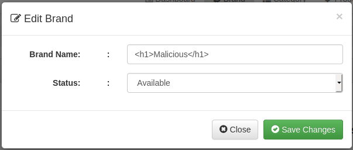

# Report of XSS Vulnerabilities

### Alberto Giust ID 211460
### Security Testing
### Project: inventory-management-system

## True Positives

- **xss_dashboard.php_10_min** (line 153): outputs the username in the orders table. If the username is a HTML formatted string, it will be printed as it is without controls, so it can be used insert malicious code. The **User Wise Order** is only seen by the admin.
  - **Attack vector**: change the username from user setting with HTML code, logout and login again. The username will be printed as a `h1`
  - **Fix**: output the username after it has been sanitized with `htmlentities($orderResult['username'])`
- **xss_fetchBrand.php_1_min** (line 38): outputs the brand name, the availability and a button to edit or remove it. It is a xss vulnerability because the brand name with HTML malicious code.
  - **Attack vector**: create a brand with this name `Malicious<script>alert("brand")</script>`. After the creation of the brand, fetch brand will be called and the alert will be printed.
  - **Fix**: sanitize the name of the brand with `htmlentities`.
- **xss_fetchCategories.php_1_min** (line 38): fetches al the categories created. The user with the right priviligies can inject malicious code in the category name and this will be printed as HTML formatted text. It is a vulnerability
  - **Attack vector**: create a new category with this name: `Malicious<script>alert("categories")<script>`. After the creation of the categorie, fetchCategories will be called and an alert will be shown.
  - **Fix**: sanitize the output of tht query (`row[1]` contains the name of the category, so you have to call `htmlentities` on it). 
- **xss_product.php_1_min** (line 109): this is a true sink because the query fetches all the brand to populate the select item for the creation of a new product. As a result, the attacker can create a brand with javascript code that won't be printed in the select option, but it will be executed when the page will be created. Only `$row[1]` is affected because `$row[0]` contains the id of the brand, a value not set by the end user.
  - **Attack vector**: create a brand with malicious javascript code in the name (`Malicious<script>alert("brand")</script>"`) and load the product page. An alert message will be printed on the screen.
  - **Fix**: sanitize the name of the brand with `htmlentities()`. However, in the product page the the list of brands are fetched two times so two alert dialogs will be shown. To completely fix this vulnerability it's needed to fix both of the outputs, this one and the one at line 267, which is found by pixy in the `xss_product.php_3_min` file. After fixing this vulnerability, no more alert dialogs will be shown, and the test will fail.
- **xss_product.php_2_min** (line 127): if a category with malicious javascript code is created, when the user opens the product page, all categories are fetched to populate the select used to create a new product. The code is executed. Only `$row[1]` is affected because contains text inserted by the user, while `$row[1]` contains only the id of the category.
  - **Attack vector**: create a category with javascript code in its name (`Malicious<script>alert("categories")</script>`). Then go to the product page. An alert dialog will pop up
  - **Fix**: at line 127, calls `htmlentities` on `row[1]`. The output will be sanitized. As for brand, also categories will prompt two alert because the categories list is fetched also at line 287, so you have to sanitize this line to avoid any alert message in the product page.
- **xss_product.php_3_min** (line 267): as for product 1, this echo function is called after fetching all brands. If the user inser malicious javascript code into a brand name, this code will be executed when the client go to the product page. The test has the same code of **xss_product.php_1_min**.
  - **Attack vector**: create a new brand with name `Malicious<script>alert("brand")</script>"`, then move to Product page. An alert box will pop up.
  - **Fix**: sanitize `row[1]` variable at line 267, surrounding it with `htmlentities`. `row[0]` is not a sink because it is the brand id. To completely fix the brand output, it is mandatory to fix also **xss_product.php_1_min**.
- **xss_product.php_4_min** (line 287): as for product 2, also in this case if a category is created with malicious code in its name, this code will be executed when the client goes to the product page
  - **Attack vector**: create a category with javascript code in its name (`Malicious<script>alert("categories")</script>`). Then go to the product page. An alert dialog will pop up.
  - **Fix**: at line 286, calls `htmlentities` on `row[1]`. The output will be sanitized. As for brand, also categories will prompt two alert because the categories list is fetched also at line 127, so you have to sanitize this line to avoid any alert message in the product page.
- **xss_fetchProduct.php_1_min**: this echo function outputs data of each not removed product. If a product is created with malicious code in the name, rate and quantity, the code will be executed eache time this php code is called. Moreover, if the user has created malicious brand and category, also this would be exectuted.
  - **Attack vector**: create a new product with malicious code in name, rate, quantity, and select a malicious brand and category, after creating it. A pop up dialog will be shown for each of the javascript code inserted
    - name: `Malicious<script>alert("name")</script>`
    - rate: `10<script>alert("rate")</script>`
    - quantity: `10<script>alert("quantitiy")</script>`
    - brand and category: select `Malicious<script>alert("brand")</script>` and `Malicious<script>alert("name")</script>`
    - image: not needed?
  - TOFIX
- **xss_fetchProductData.php_1_min**: it is called when the user adds one row for the product in the new order page.
  - **Attack vector**: create a product with malicious javascript code in its name. Then go to `orders -> add new order` and add a row of product. An alert will pop up.
  - **Fix**: sanitize the echo function calling this snippet of code before echoing the output. This code will sanitize the name.
```php
...
if(mysqli_num_rows($result) > 0) { 

    while($row =  mysqli_fetch_array($result)) {
        $row[1] = htmlentities($row[1]);
    }
}
...
```


## False Positives

- **xss_dashboard.php_3_min**: the echo function prints out the number of rows returned by the SQL query. There is no user input printed because this number is calculated by `mysqli_num_rows()` function. 
- **xss_dashboard.php_4_min**: the echo function prints out the number of rows returned by the SQL query, using `mysqli_num_rows()`.
- **xss_dashboard.php_5_min**: the echo function prints out the number of rows returned by the SQL query, using `mysqli_num_rows()`
- **xss_dashboard.php_11_min**: there is no way to exploit the total order amount to inject some malicious code. If you try to add a new product with amount that has html code in it, and then you try to create an order from it, you won't be able to see this order anywhere after it has been created (probably because the amount during the creation is set  to `Nan`). 
- **xss_index.php_2_min**: `$_SERVER['PHP_SELF']` is set up from the webserver, and no user input is printed out.
- **xss_createBrand.php_1_min**: `echo json_encode($valid);` outputs a string not written by the user that asserts that the query has been succesful.
- **xss_removeBrand.php_1_min**: `echo json_encode($valid);` outputs a strig that states the result status of an execution of a query. This string is not written by the user.
- **xss_editBrand.php_1_min**: the echo funtion outputs a string not written by the user.
- **xss_fetchSelectedBrand.php_1_min**: `echo json_encode($row);` is used to return a json object used to populate the editBrand pop-up dialog box. However in the input text the text is not formated as HTML so the attacker can't exploit this echo call to insert malicious code, and the admin will be able to see the source code inserted by the attacker.

- **xss_editBrand.php_1_min**: it outputs a not modifiable string to confirm the quesy has been performed
- **xss_createCategories.php_1_min**: the echo function prints a pre defined string used to tell the user the if the query has been performed
- **xss_removeCategories.php_1_min**: the echo function prints if the query has been performed correctly or not. The user can't insert custom value for this string.
- **fetchSelectedCategories.php_1_min**: the echo function populates the editCategory pop-up dialog, but the the name of the category is not formatted in HTML, but in palin text, so the attacke can't exploits this sink.
- **xss_editCategories.php_1_min**: the echo function outputs a string written by the webmaster to confirm the edit category action has been performed correctly.
- **xss_editProduct.php_1_min**: the echo funtion prints a message to state the query has been performed correctly. This message is not written by the user.
- **xss_editProductImage.php_1_min**: the echo function print a message, not written by the user that states if the query has been successfully executed.